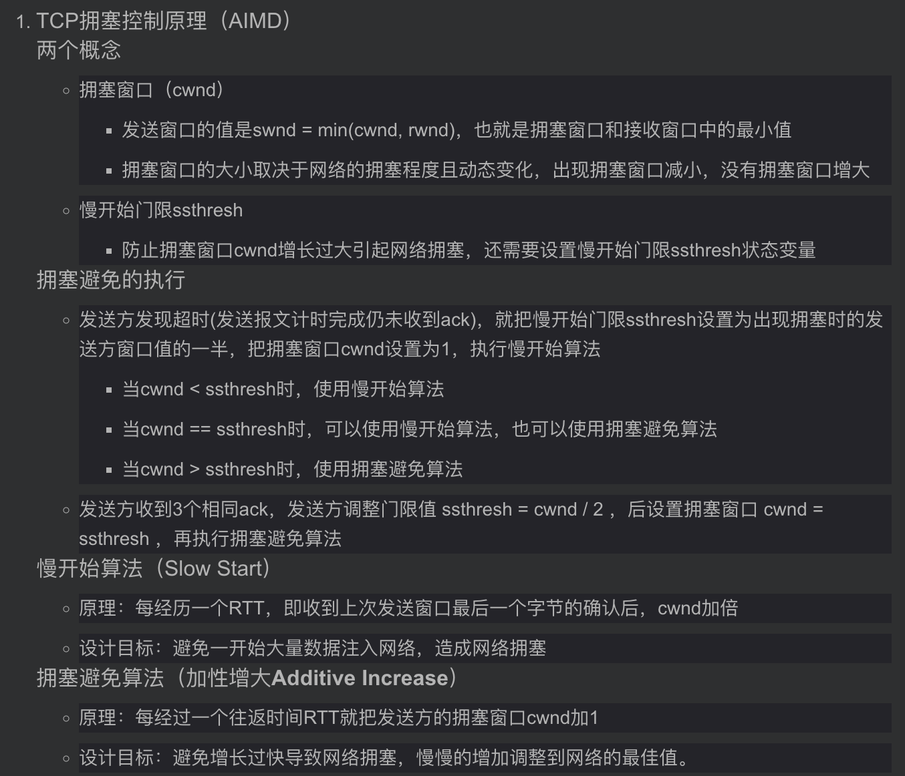

1. 假定有一个通信协议，每个分组都引入100字节的开销用于头和成帧，现在使用这个协议发送1M字节的数据，然而在传递的过程中有一个字节被破坏了，因而包含该字节的那个分组被丢弃并重传。（重点*2)
·当数据的分组大小为1000、5000、20000和40000字节时，计算相应（包括开销）的传递字节总数目（是否重传数组应该也加上头部开销，网上答案没加）
·计算分组大小的最优值是多少，即分组的大小为何值时总的传输字节数最少。（提示：最优值不是1000、5000、20000和40000字节中的一个）
``` 
1. 传递字节数 = 总数据字节数 + 头部开销 + 丢失重传字节数 （自己算）
2. 不妨设分组中有p字节数据，则数据共分为1M/p组，对应于头部开销100*1M/p，
   因此传输总字节数sum = 100*1M/p + p + 1M，接下来就是一个简单的不等式hh
```

2. 考察下图中示出的透明桥接器的布局，假定开始时所有的转发表都是空的，试给出在下列的传输序列之后，桥接器B1-B4的每一个转发表的内容： *A给C传送 *C给A发送 *D给C发送

要求在表中可以从一个端口直接到达的那个节点来标识该端口，例如：B1的两个端口可标识为B1的A端口和B1的B2端口。

``` 
原理：桥在路由表未遍历到目的地会进行广播转发并记录源节点与端口，如果记录后再查询会直接进行转发而不广播
B1：目的地A：端口A，目的地C：端口B2 （无D）
B2：目的地A：端口B1，目的地C：端口B3，目的地D：端口B4
B3：目的地A：端口B2，目的地C：端口C，目的地D：端口B2
B4：目的地A：端口B2，目的地D：端口D （无C）
```

3. 什么是对称加密算法、什么是非对称加密算法，各自的优缺点是什么？RSA是对称加密算法还是非对称加密算法？假定在RSA算法中，两个质数p=3，q=5 求解对明文10加解密的全过程？ （重点）
```
- 单密钥/对称加密算法：收发双方都使用一个密钥对数据进行加密
  - 优点：加解密速度快
  - 缺点：1. 密钥数据量大，不易于管理；2. 对密钥传输有更高的安全性要求； 3. 无法支持数据签名

- 非对称加密：加解密使用不同的密钥，私钥由一方安全保管，不能泄露，公钥可以发送给任何请求它的人
  - 优点：1. 密钥管理量小； 2. 加解密分离，保证私钥安全； 3. 支持数据签名
  - 缺点：加解密速度慢
- RSA是非对称加密
- 公钥（e = 11, n =15)，私钥（e = 3 , n = 15），明文10加解密结果均为10 
- RSA算法的计算
  - 选择一对不相等且足够大的质数p和q
  - 求n = p * q
  - 计算n的欧拉函数 φ(n) = (p-1) * (q-1) 
  - 选一个与小于且与φ(n)互为质数的整数e（互质：公约数只有1的两个整数）
  - 计算模反元素d其中，d*e mod φ(n) = 1
- 对于明文M和密文C
  - 加密：M^e mod n = C，公钥（e，n）
  - 解密：C^d mod n = M，私钥（d，n）
eg：
n = 15，φ(n) =8，令e = 3，则d为3，
加密：10^3 mod 15 = 10，即密文为10
解密： 10^3 mod 15 = 10，即密文为10

```

4. DN通常根据客户端所使用的DNS服务器地址，来指定为客户端提供数据的CDN服务器，例如根据距离自动配置的DNS服务器，为国科大怀柔小区的客户端选择位于怀柔数据中心的服务器，请分析这种DNS服务器地址变为客户端选择CDN服务器的优劣势，以及如何改进来避免这种劣势。
```
原理：基于内容访问的局部性，20%的内容吸引了80%的访问。内容分发网络CDN是构建在现有网络基础之上的智能虚拟网络，
依靠部署在各地的边缘服务器，通过中心平台的负载均衡、内容分发和调度等功能模块，使用户就近获取所需内容，
降低网络拥塞，提高用户访问响应速度和命中率。CDN的关键技术主要有内容存储和分发技术。

优势：当用户访问已经加入CDN服务的网站时，首先通过DNS重定向技术确定最接近用户的最佳CDN节点，
同时将用户的请求指向该节点。可以减轻local服务器的负载，也可以使用户更快速访问到需要的信息，从而提升用户感知
服务质量，也可以节约成本。
简答：1. 减少延迟和网络丢包； 2. 减轻服务器负载和网络拥塞； 3. 增加服务可扩展性和稳定性 4. 降低运营成本

劣势：在DNS查询过程中有这样一个问题，权威服务器接收请求的时候，只能得到localDNS的IP，并不知道client IP。
一般如果Local DNS设置不当，例如没有使用当前ISP提供的Local DNS，这种实现方法可能会误判用户的位置，从而
将用户误导到错误的CDN缓存节点，造成加速效果差的问题。
简答：1.由于服务器不知道客户端IP位置，可能将用户误导至错误的CDN节点；
     2.服务器端和缓存服务器可能会有不同步的情况（ps:边缘缓存通病

避免：可以利用end-user mapping的技术，通过client IP地址的前缀，来对client进行表示识别。
```

5. DCN内部构成一个网络，请从网络管理、协议设计的角度，定性对比数据中心网络和互联网
```
1. 网络管理
	DCN是一个的管理域，而互联网是由许多自治系统组成
	DCN使用集中控制和路径选择，而互联网使用分布式的控制和路由
	DCN从源到目的由多个路径，而互联网是单个最短路径路由

2. 协议设计
	DCN使用多种传输控制协议，如TCP In-cast，SWIFT，而互联网使用TCP和UDP进行标准化传输
	DCN相对于互联网需要更加关注突发容忍、低时延和高吞吐
	DCN在协议改进时不需要达成共识，直接由中心确认，而互联网需要达成共识

```

6. 1）什么是主动测量，什么是被动测量，它们各自的优缺点？（2）什么是链路带宽，什么是可用带宽？（3）打开一个视频网站发现在线视频的加载速度通常达不到家里宽带带宽， 请分析各种可能的原因 （4）简述一种测量可用带宽的算法工作原理（重点常考）
```
1. 主动测量
	定义：由测量用户主动发起，将探测分组注入网络，根据测量数据流的传送情况来分析网络的性能
	优点：1. 更有针对性
	     2. 测量方便，适合端到端的性能测量，在本地发送测试包观察网络响应即可 
		 3. 安全性高，不涉及用户网络信息
	缺点：1. 容易有偏采样，探测数据对背景流量也可能有影响 
	     2. 增加了网络负载

2. 被动测量
	定义：通过网络中的链路或设备上借助包捕获数据的方式来记录和分析网络流量，
	     以及网络性能状况，用户被动捕获数据进行测量
	优点：1. 不会对网络背景流量产生影响，测量准确性高 
	     2.能详尽理解观察点的网络行为
	缺点：1. 测量没有针对性 
	     2. 容易捕获网络中的敏感信息，威胁用户信息安全 
		 3. 只能获得网络局部数据，无法了解网络整体状况

3. 链路带宽：指该链路上数据报文的最大传输速率，即每秒钟传输的最大字节数。
4. 瓶颈带宽：源节点到目的节点之间处理能力最低的链路所能达到的最大数据传输速率
5. 可用带宽：是指当应用程序和其它背景流共享网络路径时，该应用程序所能得到的带宽。
           也就是指网络在不降低其它业务流的传输速率的情况下，所能提供给一个业务流的最大传输速率

6.	
    a．该视频网站和家里宽带不是一个运营商，受到限制；
    b．视频网站给用户做了限制以避免少数人占用了大多数人的资源；
    c．服务器的带宽不足；
    d．其它进程占用了带宽；
    e．电脑硬件读取和解析的能力限制了加载速度
    f. (简约版本) 网络拥塞、服务器带宽不足、服务器负载大；

PRM算法工作原理：自源端向目的端发送主动测量包，当测量包的速率大于可用带宽时，在链路瓶颈带宽上的探测包
就会发生排队现象，则导致时延增⼤的发送速率转折点处对应的速率即代表了该链路最⼤可⽤带宽。

7. 带宽测量方法（ 可选）
    a. 瓶颈带宽：变长包序列模型进行测量，源端向目的端发送n个大小相同测量包，目的端收到测量包后回复ack确认包，
	源端计算所有测量包中的最小RTT。重复k次，并每次选不同大小的数据包，计算k个包大小和RTT的差值即可；
    b. 可用带宽：探测报文速率模型(PRM)进行测量，当测试报文发送速率⼩于链路可⽤带宽时，传输时延相对固定，
	由网络物理理特性决定。当测试报⽂文发送速率大于链路可⽤用带宽时，网络出现排队现象，传输时延增大,则导
	致时延增大的发送速率转折点A处对应的速率即为该链路的最大可用带宽。
```

7. 给定一个路由转发表如下表所示，路由器收到数据包后，按照最长前缀匹配方式查找IP地址的相应转发端口。对于如下IP地址列表，请写出每个地址对应的转发端口。（重点常考）

（1）10.1.1.1          E

（2）192.168.240.1     C

（3）192.168.136.1     B

（4）192.168.224.1     C

（5）192.168.128.1     A

8. TCP/IP体系结构对移动性支持不好的主要原因是什么？为什么？如何解决？（重点常考） 
```
原因：
	1. IP地址的二义性，IP地址既表示地址又标识主机身份，即位置和身份的紧耦合
	2. 不支持身份和地址的动态绑定，当移动后，IP地址发生变化

为什么：
    因为网络连接是和IP地址绑定的，当IP地址发生变化时，连接只能断开。我们在移动的时候会改变位置但不会改变身份，
	而由于位置和身份的紧耦合导致不能单独改变位置或身份，也不能动态更新位置和身份的耦合关系，因此TCP/IP
	体系结构对移动性支持不好。
    a. IP地址既表示位置又表示身份，位置在移动中会改变，但是身份不会改变
    b. 复杂的网络协议与系统无法支持快速组网
    c. 不支持地址和身份的动态绑定，移动过程中会切换地址

解决：
	1. Mobile IP技术。移动主机有一个永久的IP地址，作为identifier，与移动前的网络有相同的前缀。
	主机移动到新网络时，获得新的IP地址，作为locator。两个地址共存。
	locator负责接收数据，identifier负责解复用数据。
	2. 连接和IP地址解绑定。当IP地址发送变化时，移动一方告知对方自己的新地址，两端的应用连接不断开。
```

9. Timeout Retransmission（超时重传）对TCP传输性能的影响体现在哪几个方面？为什么说超时重传对带宽太宽、高延迟（RTT）的网络影响最大？是否可以减小RTO时间来减小超时重传的影响？
```
原理：超时重传是TCP协议保证数据可靠性的另一个重要机制，发送端每发送一个报文段，TCP便为其保留一个副本、
设定一个计时器并等待确认信息。如果计时器超时，而发送的报文段中的数据仍未得到确认，
则重传这一报文段，直到发送成功为止

（1）两个方面：
	1. RTO时间太长，可能时RTT的几个数量级以上，在RTO时间内不能传输数据，
	因此会时发送端经过较长时间的等待后才能发现报文段丢失，降低了连接数据传输的吞吐量。
	2. 超时重传会导致进入慢开始阶段（slow start），影响传输速度。

（2）TCP根据得到的RTT值更新RTO值，发送端对每个发出的数据包进行计时，若在RTO时间内没有收到所发出数据包
对应的ACK，则重传数据，若RTO较大，则系统在长时间无法发送数据包，此时若系统的带宽也很大，则造成了大量资源
的浪费。

（3）不能直接减小。若RTO过小，可能会造成不必要的重传，浪费网络资源

注：超时重传机制主要依靠设置RTO进行控制：
若设置过大，恢复丢包的效率低；若设置过小，可能导致误重传，浪费网络资源。

```

10. 考虑如下子网。该子网使用了距离矢量路由算法，下面的矢量刚刚到达路由器C，（重点常考）

来自B的矢量为（5，0，8，12，6，2）

来自D的矢量为（16，12，6，0，9，10）

来自E的矢量为（7，6，3，9，0，4）

经测量，到B、D和E的延迟分别为6、3和5。请问C的新路由表将会如何？请给出将使用的输出线路以及期望延迟
```
实际延迟 = 延迟 + 距离向量

处理后三个向量分别为：
	（11，6，14，18，12，8）
	（19，15，9，3，12，13）
	（12，11，8，14，5，9）

对各节点距离取最小值（C除外）:
	（11，6，0，3，5，8）

路线：
```


11. 请简述“在浏览器中输入网址到获取网页内容”这段时间内发生的操作。 (考两次)
```
1. 网址域名DNS查询，解析IP地址
2. 建立TCP连接
3. 生成并向服务器发送HTTP请求
4. 服务器响应请求，返回所需网页信息
5. 浏览器解析并显示网页
====================================================
1. 浏览器分析链接指向的URL
2. 浏览器向DNS请求解析该域名的IP地址
3. 域名系统DNS解析出该域名服务器的IP
4. 浏览器与该IP的服务器建立TCP链接（默认端口为80）
5. 浏览器向服务器发起HTTP请求
6. 服务器响应HTTP把网页文件发送给浏览器
7. TCP链接释放
8. 浏览器解析并显示网页
应用层：HTTP：使用其中的WWW访问协议，DNS：域名解析服务
传输层：TCP：为HTTP提供可靠的数据传输，UDP：DNS使用UDP进行传输
网络层：IP：IP数据报的传输和路由选择，ICMP：提供网络传输的差错检测，
ARP：将本机的默认网关IP地址映射成MAC地址
数据链路层：PPP协议

```

12. 一个“客户-服务器”系统的性能受到两个网络因素的影响：网络带宽（每秒传输多少位）和延迟（第1位从客户传播到服务器花多少秒的时间）。
（1）带宽和延迟成反比关系吗？如果是，请阐述其关系；如果否，试给出一个具有高带宽高延迟的网络的例子，再给出一个具有低带宽低延迟的网络的例子。
（2）除了带宽和延迟还需要什么其他的参数，才能很好的刻画一个用于视频传输网络所提供的服务质量？
```
1. 不成反比。高带宽高延迟：卫星链路；低带宽低延迟：56kbps调制解调器。一个横贯大陆的光纤连接可以有很大的带宽，
但由于距离过长，时延也会很高；而56kbps调制解调器呼叫在同一楼内的计算机有低带宽和低延迟。

2. 抖动：网络传输时延的变化率
   丢包率：丢包率越小，网络质量越好
   启动时间：

3. 视频传输服务质量QoS参数
    传输带宽：数据的传输速率，影响最大
    传输时延：从服务器端发送数据到接受端接收到数据间的时间差
    抖动：抖动是网络传输延时的变化率，时延和抖动是可以通过缓存的办法减少影响
    丢包率：但丢包会对流媒体数据播放质量造成极其重大的影响
```

13. 在标准的TCP实现中，TCP连接空闲多长时间就会在下次发送数据包时，触发慢启动（简称SSAI，Slow start after idle）？请简述此时重新慢启动开始的原因。是否可以把SSAI直接关闭掉，请简述原因。
```
（1）一个RTO

（2）在传输开始阶段，无法确定网络传输能力，因此需要缓慢探测可用传输资源，避免短时间内大量数据注入导致拥塞

（3）两种思路
	1. 可以。节省从0增长到可用带宽的时间，提高网络利用率
	2. 不可以。在这个RTO内，可能有新的流占用的带宽，使用原窗口大小发送将导致拥塞
```

14. 在数据中心网络中，多个发送端向一个接收端发送数据时，会带来TCP Incast问题。请简述TCP In-cast 问题发生的原因，以及可能的解决方案。
```
原因：在CDN中，当多个节点向一个接收端发送数据时，产生的大量数据流量在缓冲区溢出，造成丢包以及超时重传事件，
即 TCP in cast 问题；

解决方案：（理论上不用答缺陷）
	1. 增大交换机buffer。但成本高，且当长短流混合时，短流延迟增大
	2. 减小RTO。但会导致不必要的超时重传及其带来的slow start
	3. EFC:以太网流控。实际上就是对上游节点发送pause消息，但会有head of line阻塞问题（队头阻塞）
	4. 人为增加随机delay。尾部时延降低，但整体时延（平均时延）增大
    5. 根据拥塞程度动态调整RTO的值，减少超时重传的服务器个数
```

15. 下图是Open Flow局域网络拓扑，S1的流表包含一条转发规则，Controller持有全局网络的拓扑信息。请描述Packet1 从C1到H2的转发过程，包括流表查询、流表安装流程以及具体的流表转发规则。

```
1. 首先，数据从C1的唯一端口发出，到S1
2. S1查表发现没有匹配的项，因此缓存该数据包，并查询controller
3. controller下发转发规则至S1，内容为“DstIP=H2, Outport=2”
4. S1按照相应规则，将数据包从port2发出，至S2
5. S2如上请求，得到转发规则，并转发
```

16. 互联网体系结构可自下而上分为链路层，网络层，传输层和应用层，请简述各层主要功能，与代表性协议，以及该分层模型的优缺点。
```
1. 数据链路层
	功能：向该层用户提供透明的和可靠的数据传送基本服务，进行帧编码和差错控制，使之对网络层表现为
	无差错的线路（解决分组在一个网络（或一个链路）上传输的问题）
	代表协议：
		P2P协议
		以太网协议

2. 网络层
	功能：在数据链路层提供的两个相邻端点之间的数据帧的传送功能上，进一步管理网络中的数据通信，将数据
	设法从源端经过若干个中间节点传送到目的端，从而向传输层提供最基本的端到端的数据传送服务。（负责
	为分组交换网上的不同主机提供通信服务，解决分组在多个网络上传输（路由）的问题）
	代表协议：
		IP
		ARP（地址解析协议）
		ICMP（网际控制报文协议）
		路由选择协议
		NAT（网络地址转换协议）
		
3. 传输层
	功能：主要负责向两个主机中进程之间的通信提供服务，提供差错控制和流量控制
	代表协议：
		TCP
		UDP

4. 应用层
	功能：负责通过应用进程间的交互来完成特定网络应用的任务。（为应用进程提供服务）
	代表协议：
		FTP
		DNS
		HTTP
		SMTP
```

17. 交换机/路由器将待处理的数据包放到缓冲队列中， 缓冲队列的大小对设备的转发性能有很大的影响，请简述队列过大或过小对传输流的性能影响。 RED 机制可以缓解队列过大带来的性能问题， 请简述该机制的运行过程。
```
队列大小的影响：
	缓冲区太小，会导致丢包率过高，数据链路利用率低，TCP传输效率低
	缓冲区太大，会导致网络拥塞时，数据包转发时延过大

RED（Random early detection）随机早期检测
	在RED中，为缓存队列都设置了一个最小阈值和最大阈值，当收到数据包时：
		- 若队列长度小于最小阈值，直接加入缓存队列
		- 若队列长度大于最大阈值，直接丢弃数据包
		- 若队列长度位于两者之间，开始按一定概率丢弃数据包。队列越长，丢弃概率越高
```

18. OSPF 路由协议的核心是链路状态机制，请简述该协议的运行原理，拓扑变动后的收敛过程以及如何拓展到规模更大的网络环境的方法。
```
第七个实验mospf，做过自然懂嗷

运行原理：
	OSPF设备向外发送hello包，与其他使用相同协议的设备建立邻居关系
	互相发送LSA（链路状态通告）相互通告路由，形成LSDB（链路状态数据库）
	基于LSDB通过SPF算法，计算通向每个目的网络的最佳路径后，放入路由表。
	
收敛过程：
	进行LSA的泛洪
	收集泛洪的LSA集合，进行LSDB的组建
	基于LSDB用SPF算法得到一颗以自己为“根”覆盖全网的无环的树
	
扩展方法：
	将一个自治系统再划分为若干个更小的范围，叫区域，使更新过程收敛更快
```

19. TCP 拥塞控制机制，包括慢启动、拥塞避免、快速重传、快速恢复等功能，这些功能共同完成了数据流的高可靠和高性能传输请简述每种功能的原理和设计目标。



20. 请简述基于 Trie 树的 Ipv4 路由表查找算法的时间和空间复杂度以及基于 Ipv6 的路由表的查找算法的优化方法。（今年ppt没这玩意，应该不考吧）

```
复杂度：
	假设查找字符串长度为n，则时间复杂度为O(n)
	字典树每个节点都需要使用一个数组来存储子节点的指针即便实际只有两三个子节点，但依然需要
	一个完整大小的数组。所以，空间复杂度较高O(26^n)
	
基于Ipv6的路由表的查找算法：基于前缀hash表的二分搜索

优化方法：
	降低时间复杂度: Sail
	降低空间复杂度: DxR
	在时空复杂性上进行折衷考虑和优化: Poptrie
```

21.  简述区块链上数据不可伪造、不可抵赖、难以删除和难以篡改的技术原理，区块链的共识算法的作用是什么？请举出现实生活中用区块链技术解决实际问题的一个实例，并说明区块链解决了其中的什么问题。 区块链与分布式数据库的异同？
```
区块链原理:
	单点出块：指定一个节点生成账本
	广播机制：将生成的账本广播给所有节点
	交叉验证：全网参与，协作完成交易验证
	共同存储：分布式记账，不依赖单个中心

共识算法作用：确保分布式系统的一致性，保证区块信息达成全网的一致共识

以国家法定数字货币业务场景作为例，阐述问题与解决方法
	可编程的交易过程解决了精确可控的货币政策问题
	扁平化架构解决了扩大流通范围取代纸币的问题
	共同记账解决了高效便捷的跨境支付清算问题

不同点
	区块链只能进行查和插，分布式数据库可以进行增删改查
	区块链每个节点通常保存全量数据，分布式数据库一般只保存部分
	区块链强调参与者平等、共享，公开透明、共建，分布式数据具有单一拥有者
	区块链节点间协作不需要相互信任，分布式数据库节点间的协作建立在相互信任的基础上
	区块链容错机制好，分布式数据库容错能力低
	
相同点：
	共识机制：一致性控制 — 共识机制
	存储机制：数据库日志 — 账本
	智能合约：智能合约 — 存储过程
```

22. BBR 是 Google 提出的一种拥塞控制算法，其核心思想是测量最小 RTT 和瓶颈链路的可用带宽，请简述为什么最小 RTT 和瓶颈链路的可用带宽不能同时测得，以及如何才能较为准确地测量这两个值。
```
原因：
	要测量最大带宽，就要把瓶颈链路填满，此时buffer中有一定的数据包，自然测不了最小RTT
	要测量最低延迟，就要保证buffer为空，网络中的数据包越少越好，这也与瓶颈链路带宽的测量条件相悖

如何准确测量：
	 针对测不准的问题，在论文中BBR算法采⽤的⽅案是，交替测量带宽和延迟，⽤⼀段时间内的带宽极⼤值
	 和延迟极⼩值作为估计值，动态更新测量值，最终控制发送速率，避免⽹络拥塞。
```

23. CDN 依赖于 DNS 实现用户到服务器的映射，假设使用传统 DNS 协议，用户侧配置公用的 DNS 服务器（如 8.8.8.8）和使用运营商自动配置的本地 DNS 服务器会对这种映射造成什么影响？如何缓解这种影响？
```
影响：
	在DNS查询过程中，权威服务器接收请求的时候，只能得到本地DNS的IP，并不知道客户端IP。如果本地
	DNS设置不当，可能会误判用户的位置，将用户误导到错误的CDN缓存节点，造成加速效果差的问题。

缓解：
	可以利用end-user mapping的技术，通过客户端IP地址的前缀，来对客户端进行表示识别。
```

24. NDN 等未来互联网体系结构试图改变 TCP/IP 协议的哪些方面，为什么这些新型的互联网体系结构部署比较困难？
```
改变：
	可拓展性：在现有互联网体系结构中，只能通过不断地增加硬件设备进行拓展
	动态性：使网络中身份和位置分离，增加可移动性
	安全可控性：构建面向服务和数据的安全架构，从源头上限制网络攻击行为的发生
	
部署困难原因：
	网络规模太大，不易统一部署
	且过去的网络设备在设计之初并没有考虑到这些问题，无法直接应用这些架构
```

25. 最小生成树机制能够在有环的物理网络中构造出一个无环的树状逻辑拓扑，在保证网络连通性的同时避免广播风暴。当网络是静态时，即不存在节点/链路的加入和删除，网络对应的最小生成树拓扑是否是唯一的？简述或举例说明
```
构造的最小生成树是可能不唯一，但是最小生成树的权值是唯一的。
当无向图中存在相同权值的边，并且该边的权值小于最小生成树中边集的最大权值，则一定存在多个最小生成树。（自由发挥）
```

26. 考虑下图中的网络拓扑，每条边上的数字代表对应链路的代价，使用距离向量的方法进行网络路由选择，当前节点A和C的路由表项分别如下两个子表所示，当两个节点分别收到节点B的距离向量信息（A:2，B:0，C:4，D:2，E:1，F:3）后，试更新两个节点的路由表项。

```
和2016.10差不多，简简单单，自由发挥！

貌似就更新了C的ADF三项，cost分别为6，6，7，下一跳均为B（自行验证啊自行验证）
```


27. 基于路由转发表的表项进行最长前缀，确定下一跳转发路径，是路由查找转发的基本动作。Trie查找是主要路由查找算法之一，下图（a）是路由表的示例，图（b）是对应的trie数据结构。请描述IPV4路由查找中Trie查找过程。分析时间复杂度和空间复杂度。

```
查找过程：
    1. 从根结点开始一次搜索；
    2. 取得要查找关键词的第一个字符，并根据该字符转到对应的子树进行检索
    3. 在相应的子树上，取得要查找关键词的第二个字符,并进一步选择对应的子树进行检索。
    4. 迭代过程……
    5. 在某个结点处，关键词的所有字符已被取出，则读取附在该结点上的信息，即完成查找

时间复杂度：O(n) n为路由长度
空间复杂度：O(1) 无额外空间
```

28. TCP通过AIMD（加性增，乘性减）机制来探测可用带宽和保障竞争流间的公平性。只考虑AIMD机制，试在如下图（a）中画出一个TCP流的拥塞窗口随时间变化的形状，并说明该形状的变化周期。对于两个竞争流，从如下图（b）中的起始点出发，在图中通信两个竞争流的发送速率收敛到最优点过程中的变化曲线。

```答案参考下面这个图：不知道为啥的再去看看TCP机制
```


29. TCP传输协议中，发送的字节数与吞吐及RTT的关系如下图所示。假设路径的传输时延为RTT，瓶颈链路带宽为BW，瓶颈链路处的队列长度为Q，则（1）D1, Slope1, Slope2, S1, S2分别为多少？（2）BBR根据传播时延与瓶颈链路带宽的乘积设置拥塞窗口，如何测得传播时延RTT，以及瓶颈链路带宽BW？

```
（1）D1 = RTT; Slope1 = ?; slope2 = 1 / RTT; S1 = BW * RTT; S2 = BW * RTT + Q


（2）前面有，略
```

30. 假设不使用EDNS，当客户端使用Google：8:8:8:8 等公共DNS解析服务器进行内容访问时，CDN有可能会给用户分配的CDN服务器离客户端距离较远，原因是什么？EDNS为什么能协助解决这个问题？Google的8:8:8:8使用Anycast技术也能在一定程度上缓解该问题。请问原理是什么？
```
（1）CDN的加速资源是跟域名绑定的，公共DNS由于结点数有限，可能经常离用户很远
原理：寻找CDN是由DNS服务器去查询的，因此寻找CDN的过程其实并不知道用户地址；
如果是本地DNS则可以找到较近的CDN服务器，若使用公用DNS则可能不能获取到较近的CDN资源，影响用户感知体验。

（2）EDNS根据用户请求来对同一域名作出相应的不同解析，允许DNS resolver传递用户的ip地址给
权威DNS服务器以进行精确调度

（3）Anycast则允许客户端向一组目标服务器发送数据，而这组服务器中最终处理数据的服务器是由路
由系统选择“最近”服务器。
```

31. 数据中心网络问题：
ECMP是如何实现流级别的负载均衡的？
流级别负载均衡和数据包级别的负载均衡相比，劣势是什么？
基于ECN的拥塞控制在数据中心网络中广泛使用，简述其原理，以及为什么能缓解TCP Incast问题。
``` 
（1）当路由器发现同一目的地址出现多个最优路径时，会更新路由表，为此目的地址添加多条规则，对应于多个下一跳，
可同时利用这些路径转发数据，增加带宽。

（2）ECMP对于流大小相差不多的情况效果更好，而对于流大小差异较大，特别大的数据流无论选择哪条路径都容易造成拥塞

补充：
	优势：数据包级别的负载均衡需要对每一个数据包进行查表操作，因此转发效率较低；
	     而流级别负载均衡转发效率更高
	劣势：对于长短流差距较大的情况，流级别负载均衡难以达到预期效果
	
（3）基于的丢包反馈、路径延时反馈、显示反馈等信息进行拥塞窗口调节。
交换机作为集中控制器计算所有流的平均窗口值AVG，通过显示反馈给发送端，发送端统一将发送窗口调整为AVG大小来公平的分配带宽。

补充：
	具体来说，在DCTCP方法中，在交换机处有一个阈值K，若数据包到达时，队列占用量大于K，则标记该数据包。
	当receiver接收到带有标记的数据包后，返回带有ECN标记的ACK给发送端，发送端以此调节拥塞窗口的大小。
```

32. 未来互联网体系结构NDN、SOFIA、MobilityFirst等强调名字Name和地址Address的分离，请问名字与地址分离解决什么问题？与TCP\IP体系结构不同，NDN是接收端驱动的，即接收端发送Interest数据包，发送端收到Interest数据包后才回复Data，且Data沿着Interest数据包的反向路径发送给接收端，这样做的好处与劣势是什么?
```
名字和地址分离是支持移动性的关键

优势：
	不存在身份与地址的绑定，支持移动性
	安全性和可拓展性增强
	减少冗余传输，节省带宽
	
劣势：
	名字不定长，在路由表中难查找
	网络设备的实现和维护复杂
```

33. 负载均衡是数据中心网络中提升带宽利用效率的重要机制，请简述数据包级别的负载均衡和数据流（flow，五元组标识）级别的负载均衡的优劣势。

34. 什么是RSVP协议？RSVP协议的特点
```
原理：
    为一个数据流通知其所经过的每个节点（IP路由器），与端点协商为此数据流提供传输质量的保证
特点：
    1. 工作在IP协议之上，属于OSI模型的传输层
    2. 本身并不处理传输层的数据，是一个网络控制协议
    3. 可以在点对点单播或多点对多点的组播网络通信应用中进行资源预留
    4. 是一个单向的资源预留协议
    5. 面向接收端的资源预留协议，由会话的接收端发起资源预留请求
    6. 对不支持它的路由器提供透明的操作

```
35. 信息系统的四个特性
```
保密性（机密性）：不将有用信息泄露给非授权用户
完整性：信息在传输和处理过程中，保持信息不被破坏、丢失和信息未经授权不能修改
可用性：信息资源可被授权实体按要求访问
可控性：网络系统和信息在传输范围和存放空间内的可控程度
不可否认性：所有参与者不可否认或抵赖本人的真实身份，以及提供信息的原样性和完成的操作与承诺。
```
36. 区块链的特点和所用技术
```
不可伪造、不可抵赖：所有交易都要使用数字签名技术
不可删除、不可纂改：哈希链表，改一个块需要更改其后的所有块
```


